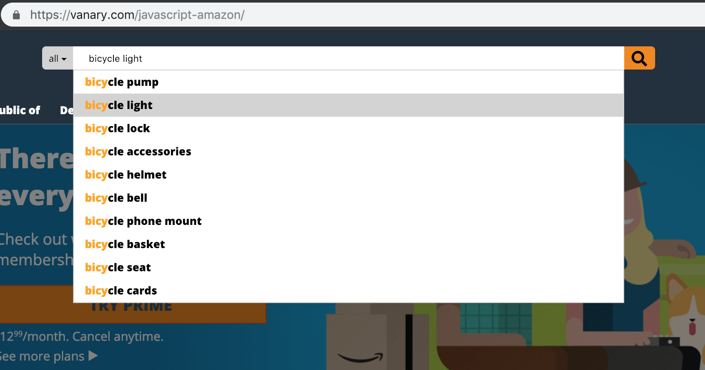

# TIL: This (Week) I Learned (코드스쿼드 17주차 회고)

## 한 주 요약

이번 주를 끝으로 아마존 따라 만들기 과제를 마쳤습니다.

Node.js를 이용해 뭔가를 만들어보니, 예전에 HTML과 CSS를 처음 접하고 메모장으로 웹페이지를 띄워보던 때 처럼 흥미로웠습니다. 언젠가 Progressive Web App을 만들어보는 날을 기대하며 꾸준히 공부해야겠습니다.

## 공부한 내용들과 자료 링크

### Fetch와 Promise 학습 & 사용

Fetch와 그의 Interface / Body Mixin 살펴보기: Promise 자체의 개념에 비하면, 그걸 사용한 API는 이해할만 했습니다.

- https://devdocs.io/dom/fetch_api/using_fetch
  - https://developer.mozilla.org/en-US/docs/Web/API/WindowOrWorkerGlobalScope/fetch
  - https://developer.mozilla.org/en-US/docs/Web/API/Fetch_API

Promise Object에 대한 설명 살펴보기

- https://medium.com/javascript-scene/master-the-javascript-interview-what-is-a-promise-27fc71e77261
  이 글 덕분에 Promise에 대한 감이 좀 잡혔습니다!  
  Promise는 '아직 정해지지 않은 결과값을 전달하는 포장된 데이터' 입니다. 프로그램 흐름 중간에 .then() 메서드 속 함수가 어떻게 인자로 받은 Promise에서 필요한 데이터를 추출하는지 고민하고 있었는데, 그럴 필요가 없다는 걸 알게 되었습니다.

택배가 물류를 타고 전해지듯이, Promise라는 포장지의 메서드를 이용해 값이 프로그램을 따라 흘러간다고 생각하니 좀 도움이 되었습니다. .then() 메서드가 받는 인자는 resolver 함수이고, 그 함수에 알맞은 인자를 Promise가 포장지 안에서 꺼내서 전달하는거죠.

이해는 좀 늘었지만 아직 궁금한 점이 남아있습니다. 특히 함수 안에서 Promise를 사용해서 비동기로 데이터를 받아온 다음에, 이를 어떻게 반환해서 다른 함수에서 비동기로 호출한 데이터를 공유하게 할 지가 고민입니다.

이벤트를 섞어서 Observer 패턴을 쓰면 될 것 같기도 하고... 좀 더 찾아서 공부할 계획입니다.

### Blob: https://developer.mozilla.org/en-US/docs/Web/API/Blob

JavaScript native 자료형이 아닌 데이터를 가공해서 JS 코드 안에서 사용할 수 있게 돕는 API라고 이해했습니다.

위에 있는 MDN 문서의 사용례에서, URL.createObjectURL(blob)을 이용해 웹 문서에서 blob(이미지 파일)을 변환해 URL을 사용하는 메서드/HTML에 링크할 수 있는 게 신기했습니다.

### 검색창 자동완성 기능 / 간단한 API 서버 구현

학습용으로 만들고 있는 아마존 카피 (<https://vanary.com/javascript-amazon/>)에 검색창 자동완성 기능을 추가했습니다.

#### 프론트엔드에서는

지원하는 키워드(iphone, javascript, bicycle hel)에 한해, API에 CORS 요청을 하고 JSON을 받아, 추천 검색어 목록을 띄우는 구조입니다.
띄워진 추천 검색어는 키보드 상하 화살표키로 탐색할 수 있게 구현했습니다.  
검색창이 포커스를 잃으면 검색 목록이 닫히는 부분도 구현했구요.

키보드를 이용한 메뉴 탐색을 구현하면서 키보드 이벤트 관련해 새로 배운 점이 있었습니다.

- 키를 누를 때 세 번의 이벤트(Keydown / Keypress / Keyup)가 발생한다는 점
  - https://devdocs.io/dom/keyboardevent
- 브라우저에 따라 이벤트의 기본 동작을 실행하는 타이밍이 다르기 때문에, 키보드 이벤트를 Event.preventDefault() 할 때 생각과 다를 수 있다는 점이 있었습니다.
  - 두 번째 배움은 실제 코드 구현할 때 써먹을 일이 있었습니다. 화살표키로 메뉴를 탐색할 때 검색창 안의 커서가 와리가리하는 걸 방지하려고 Event.preventDefault()를 삽입했지만, 크롬은 KeyDown 이벤트에 기본 동작을 발생시켜서 KeyUp에 부탁했던 이벤트 리스너를 KeyDown을 지켜보도록 바꿔서 해결했습니다

더불어, 이번 모듈을 구현할 때는 디자인 패턴을 적용해봤습니다.
지난 주에 공부한 MVC 패턴과 Observer 패턴에 의욕이 불타올라 바로 써먹어보니, 확실히 최소 기능 단위로 개발하기 좋아서 테스트하기 편하고 유지보수할 때도 문제가 되는 부분이 확실히 보여서 좋았습니다.

다만 데이터가 입력되었을 때 여러 모듈을 거치며 처리하다 보니, 코드의 응집도가 떨어져서 전체적인 프로그램의 흐름은 머리에 잘 들어오지 않았습니다.

MVC 패턴은 대규모 프로그램을 작성할 때 큰 구조를 튼튼하게 설계할 때 쓰고, 변경이 뜸할 원자 모듈은 디자인 패턴보다 개발자가 흐름을 빨리 파악할 수 있게 사람이 읽기 좋게 개발하면 어떨까 생각이 들었습니다.

#### 백엔드에서는

이번 주에는 백엔드 기초도 공부하기 시작했습니다.

- https://expressjs.com/en/starter/installing.html
- https://www.inflearn.com/course/node-js-웹개발/

express의 기본 문서와, 위 인프런 강좌를 참고하며 정해진 추천 검색어를 반환하는 API를 Node.js 기반에 Express를 이용해 앱 서버를 만들었습니다.

이왕 해본 김에 로컬에서만 동작하기보다 웹으로 연결되는 API 서버를 만들어보고 싶어서, Heroku에 올려서 CORS 로 웹 페이지가 API를 호출하도록 구현했습니다.

- https://www.heroku.com/dynos
  _블로그를 업로드하는 시점에는 아직 Heroku 무료 회원이라, API가 쉬고 있을 확률이 높습니다. 데모 페이지에서 검색 자동완성이 안되어도 놀라지 마세요!_

데이터를 받기만 하다가, 다른 도메인에 데이터를 반환하는 API를 만들다보니 CORS에 대해 좀 더 배우는 부분이 있었습니다.

최초에 API를 활성화하고 데모 페이지에서 검색 API를 테스트해볼 때였습니다.  
CORS 요청을 위해 HTTP OPTIONS 요청이 데모 페이지에서 API로 무사히 가고, API가 GET, POST가 가능하다고 회신하는 데, 그 이후에 뒤따르는 HTTP 요청 없이 프로그램이 잠잠해지는 상황을 겪었습니다.

구글에서 검색해보니 Stack Overflow에 저와 같은 문제를 겪은 사람들이 많은 걸 알 수 있었습니다.
살펴보니, CORS preflight 요청 (위의 HTTP OPTIONS 요청)이 왔을 때 API가 CORS 관련 헤더를 반환해주지 않아서 생기는 문제였습니다.

- https://developer.mozilla.org/en-US/docs/Web/HTTP/CORS#Preflighted_requests

Allow-Control-Allow-\*(Origin, Method, Headers) 헤더들을 서버에서 잡아주니 무사히 프로그램이 API에 CORS를 이용한 HTTP GET 요청을 보냈습니다.

## 느낌과 다음 주 목표

목표한 시간 동안 과제에만 집중해 잘 마무리했으니, 다음 주 부터는 자바스크립트 밖의 개발자 기초를 쌓는 시간을 좀 더 늘리려고 합니다. 꾸준히 하루에 일정한 시간을 투자해 알고리즘과 자료구조 기초를 공부하겠습니다.

더불어, 면접을 대비하고 미래에 개발자로서 의사소통을 하기 위해서 '개발자답게 말하는' 법을 연습할 계획입니다. Stack Overflow에 올라온 질문을 살펴보고, 좋은 답변은 공부하고 제가 해결할 수 있는 질문은 답변글을 남겨보고 싶습니다. 더불어 코드스쿼드 동료들의 코드도 더 자주 보고 물어보면서 넓게 배우고 싶습니다.

다음 주도 즐겁게!
