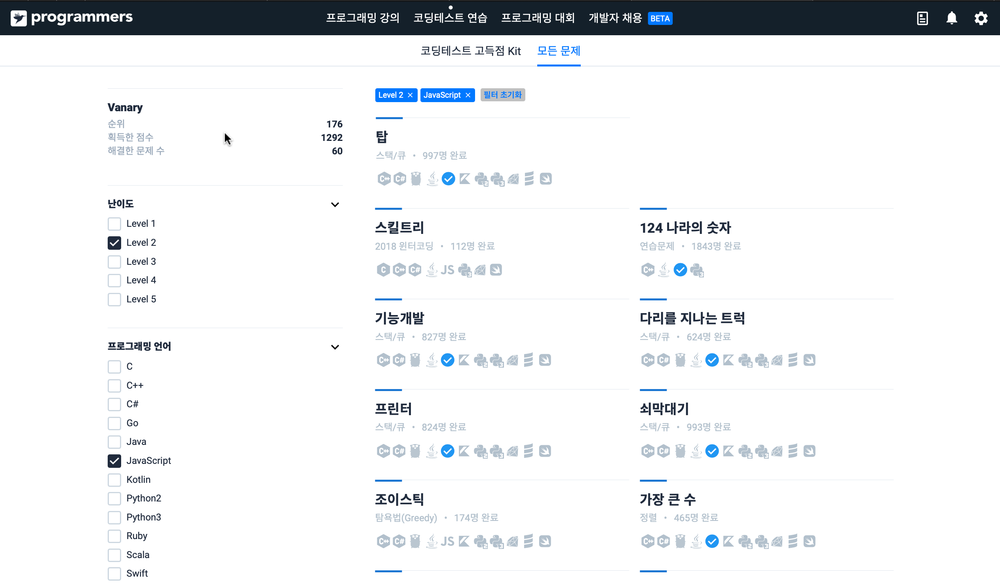
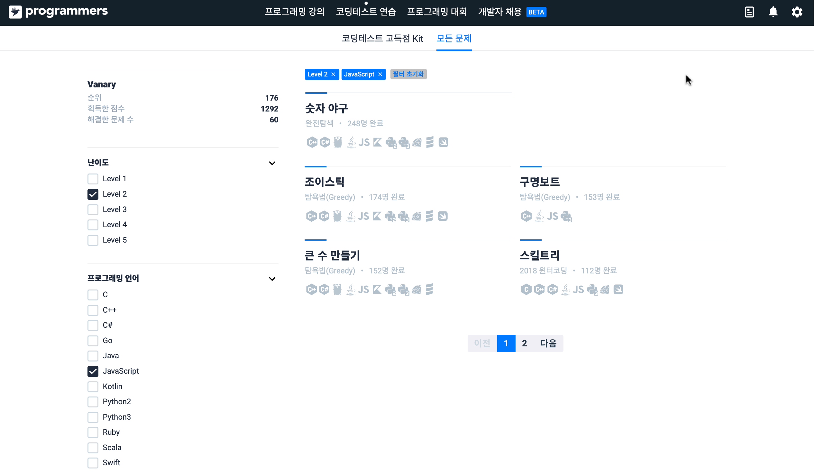

# TIL: This (Week) I Learned (코드스쿼드 19주차 회고)

## 한 주 요약

React를 기반으로 프로그램을 개발하면서, 개발환경 구축을 위한 제반 지식을 살펴본 한 주였습니다.  
계획한 대로 꾸준하게 알고리즘을 푸니 개발 문서들 파헤치는 나날에 상쾌한 두뇌 스트레칭 시간이 생겨서 좋았습니다.

## 공부한 내용들과 자료 링크

### 알고리즘과 자료구조

프로그래머스(<http://www.programmers.co.kr/>)에서 2레벨 문제를 마저 해치우고 있습니다.

| 문제 및 링크                                                                                                                       | 후기                                                                                                                                                                                                                                                                                                                                                                   |
| ---------------------------------------------------------------------------------------------------------------------------------- | ---------------------------------------------------------------------------------------------------------------------------------------------------------------------------------------------------------------------------------------------------------------------------------------------------------------------------------------------------------------------- |
| 가장 큰 수 ([GitHub Link](https://github.com/Vanary/Algorithm_and_practices/blob/master/Programmers/%5BL2%5D_가장_큰_수.js))       | Trie로 풀려고 시간을 소비하다가, 2레벨 문제가 거기까지 가지 않을 것 같아서 생각을 고치니 풀 수 있었습니다. 문제가 '정렬' 카테고리에 있는 걸 힌트로 1차 정렬 후 O(N^2) 알고리즘으로 풀었더니 효율성에서 탈락해서 두 번째 고비를 겪었습니다. 좀 더 생각해보니 정렬 알고리즘은 Sort 메서드를 빌려 쓰면 될 것 같아서 array.sort 메서드를 이용해 O(NlogN)으로 해결했습니다. |
| 타겟 넘버 ([GitHub Link](https://github.com/Vanary/Algorithm_and_practices/blob/master/Programmers/%5BL2%5D_타겟_넘버.js))         | BFS로 쉽게 해결!                                                                                                                                                                                                                                                                                                                                                       |
| 카펫 ([GitHub Link](https://github.com/Vanary/Algorithm_and_practices/blob/master/Programmers/%5BL2%5D_카펫.js))                   | 경우의 수를 반복문으로 확인해서 해결했습니다. 다른 분들 코드를 보고, 문제 해결에 꼭 필요하지 않은 정보는 추상화해서 코드를 간결하게 할수 있다는 점을 깨달았습니다.                                                                                                                                                                                                     |
| 영어 끝말잇기 ([GitHub Link](https://github.com/Vanary/Algorithm_and_practices/blob/master/Programmers/%5BL2%5D_영어_끝말잇기.js)) | 가볍게 해결~!                                                                                                                                                                                                                                                                                                                                                          |
| 소수 찾기 ([GitHub Link](https://github.com/Vanary/Algorithm_and_practices/blob/master/Programmers/%5BL2%5D_소수_찾기.js))         | 경우의 수를 저장하는 함수 따로, 소수 판별 함수 따로 하다보니 코드가 길어져서 부끄러운 마음을 안고 제출했습니다. 다행히(?) 다른 분들도 코드가 길어서 묘한 안도감을 품으며 마무리했습니다.                                                                                                                                                                               |
| 폰켓몬 ([GitHub Link](https://github.com/Vanary/Algorithm_and_practices/blob/master/Programmers/%5BL2%5D_폰켓몬.js))               | 문제는 길지만 풀이는 간단했습니다                                                                                                                                                                                                                                                                                                                                      |

**가지 치기**

프로그래머스에서 한 문제를 풀고 다음에 풀 문제를 찾을 때, 1) 이미 푼 문제는 숨기고, 2) 정답자가 많은 순서로 정렬해서 문제 목록을 보고 싶었습니다.

없으면 만드는 게 개발자렸다, '이미 푼 문제'를 숨겨주는 JavaScript 코드를 작성해 동료들과 공유했습니다.
(덕분에 기념비적인 첫 깃헙 Star도 받았네요~!)

- GitHub: <https://github.com/Vanary/programmers-filter-cleared/>

| 필터 전                                                                     | 필터 후                                                                  |
| --------------------------------------------------------------------------- | ------------------------------------------------------------------------ |
|  |  |

### 개발환경 설정 살펴보기

개발환경 구성에 사용되는 도구들의 공식문서를 훑어봤습니다...만. 문서만 통으로 보려니 영 눈에 안 들어와서 빠르게 굵직한 개념만 살펴봤습니다. 다음에 React로 프로젝트 시작할 때 쓰면서 경험으로 배울 계획입니다.

- webpack
- Babel
- Jest

### 강의 & 실습

- Symbol: 숨겨진 속성값/메서드를 만드는 데 쓸모가 있겠다 싶었습니다.
- Iteration, Generator: Yield를 이용한 비동기 처리 코드가 보기 좋았습니다

### 리액트 진입!

바닐라 JS/CSS로 코딩하며 기초를 다지고, 이제 라이브러리를 이용한 개발을 연습하기 시작했습니다.

변화가 빨라 공식 문서를 보는 게 좋다는 조언을 듣고 처음부터 차분히 코드를 따라가며 정주행하고 있습니다.

- React 튜토리얼
  - https://reactjs.org/tutorial/tutorial.html#lifting-state-up
    프로그램의 '상태' 관리 패러다임이 신기했습니다. 지지난주에 Observer 패턴을 살펴본 게 개념 이해에 도움이 된 것 같습니다.
- CRA 대신 직접 환경설정 하는 튜토리얼
  - https://blog.usejournal.com/creating-a-react-app-from-scratch-f3c693b84658
  - Create-React-App 모듈의 간편함은 좋지만, 내부가 어떻게 돌아가는 지 대략은 알고 싶어서 위 글을 살펴봤습니다. CRA 없이 직접 webpack과 Babel을 설치해서 기초 환경설정을 진행해봤습니다.
- 와 Lifecycle 관리!
  - https://reactjs.org/docs/state-and-lifecycle.html
  - DOM 객체가 아니라 JS 네이티브 객체로 콤포넌트를 만들어두고 재활용해서 DOM의 변화를 최소화 하는 구조가 좋았습니다.
- 클래스 상속 대신 재활용 (Composition instead of Inheritance.)
  - https://reactjs.org/docs/composition-vs-inheritance.html
  - 깔끔하고 단단한 느낌. CSS 전처리기 느낌도 살짝 들었습니다.

**가지 치기**

- 위의 'CRA 없이 환경설정 튜토리얼'을 보다가, Node 모듈 Path의 join 메서드와 resolve 메서드를 한 모듈에서 동시에 쓰는 예시를 봤습니다. 결과값이 Path로 같아 보이는데 차이가 무엇일지 궁금해 살펴봤습니다.

  join은 '경로'값들을 인자로 받아서 합치고 정규화해 줍니다. 메서드 이름 그대로 '통합된 경로'값을 반환하므로, 반환된 경로는 상대 경로일 경우가 많습니다.

  한편, resolve는 경로 값들을 차례로 붙여서 '절대 경로'가 반환되는지 확인합니다.  
  절대 경로가 반환되지 않는다면 인자를 조작해 만든 경로 맨 앞에 명령어가 실행된 디렉토리의 절대 경로를 삽입합니다.

  - 참고 : https://stackoverflow.com/questions/35048686/difference-between-path-resolve-and-path-join-invocation
    > _"resolve는 순서대로 cd (인자) 명령어를 입력한 결과의 절대 경로를 반환한다고 생각하면 쉽다!"_

- DRY: Don't Repeat Yourself 리액트 문서에서 종종 쓰이는 약어인데, 다른 문서에서도 보게 될 것 같아서 기록해둡니다.

## 느낌과 다음 주 목표

공식 문서를 통해 React 기본 개념을 살펴보았으니, 다음 주에는 같은 문서에서 심화 개념을 살펴보고 스켈레톤 코드를 작성하며 'React로 생각하는' 법을 연습해보겠습니다.
