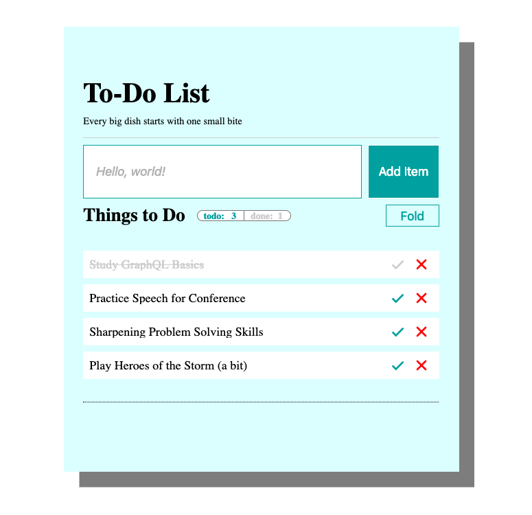

# TIL: This (Week) I Learned: React, Heroku, Hackerrank

## 한 주 요약

할일 앱에 기본 기능과 UI를 추가했습니다. 예전에 작업했던 결과물을 활용하니 빠르게 추가 기능을 구현할 수 있었습니다.  
새로운 플랫폼에서 알고리즘 공부를 시작했습니다.

## 공부한 내용들과 자료 링크

### React - 할일 앱

- 데모 페이지: https://vanary.com/javascript-web-todo/

React로 작성중인 할일 앱에 CRUD 메서드를 마무리했습니다.

프로젝트 초기에 만들어둔 할일 생성/삭제 기능에 더해,  
지난 주에 추가한 GraphQL 서버에서 초기값을 읽어오는 메서드와 저장된 할일 목록의 정보(완료 여부, 제목)를 수정하는 메서드를 구현했습니다.

**상태 토글 기능과 종류별 갯수 UI가 추가된 현 상황**

할일 초기값을 가져오는 API를 배포하려고 하니,  
예전에 아마존 클론 사이트를 만들 때 검색 자동완성 API를 만들어 Heroku에 배포해둔 게 생각이 났습니다.

- 아마존 클론 데모 페이지: https://vanary.com/javascript-amazon/
  - 검색창에 iphone, javascript, bicycle 중 한 단어를 입력하고 잠시만 기다려보세요~!

새로 서버 인스턴스를 짜도 되겠지만,  
이번 기회에 서버에 라우팅을 추가해 미들웨어를 써보는 연습을 해보고 싶어서 검색 API에 할일 처리 엔드포인드를 추가했습니다.

그리고 이왕 API를 수정해서 쓰는 김에
[30분간 트래픽이 없으면 수면 모드](https://devcenter.heroku.com/articles/free-dyno-hours#dyno-sleeping)가 되는 무료 호스팅 제약을 해결하도록
Heroku App Dyno를 깨워주는 서비스([Wake My Dyno!](http://wakemydyno.com/))도 적용했습니다.

그 덕분에 잠꾸러기였던 아마존 클론의 자동완성 기능도 블로그에서 자랑할 수 있게 됐네요! 😄

### 알고리즘 - Hackerrank: 30 days of algorithm

지금까지 프로그래머스에서만 알고리즘 풀이를 연습했는 데,  
해외 서비스([Hackerrank](https://www.hackerrank.com/), [Codility](https://app.codility.com/programmers/))에서도 코딩 테스트를 연습할 필요를 느껴 Hackerrank에서 첫 삽을 떴습니다.

프로그래머스와 달리 Node 기반으로 문제를 풀어야 하다보니 낯선 부분이 있었습니다.  
미리 다른 풀이환경을 접하길 잘 했다는 생각을 하며 튜토리얼 격인 30 days of code 과정을 시작했습니다.

이름 그대로 30일 동안 문제를 하루에 하나씩 푸는 과정인데,  
문제를 일찌감치 풀어도 다음 문제를 풀려면 하루를 기다려야 하는 문제가 있었습니다.

튜토리얼에 한 달이나 쓰고 싶지 않아서 요리조리 뜯어본 끝에 문제 본문 URI에 바로 접속해 기다림 없이 문제를 풀 수 있었습니다.  
문제 목록에만 시간 경과에 따른 분기처리를 해두고 문제 본문에는 적용하지 않았던 모양입니다.  
덕분에 주말에 쭉 과정을 진행해 21일차까지 마무리했습니다.

## 느낌과 다음 주 목표

코드스쿼드의 공식 과정 마지막 주를 맞이합니다!

할일 앱에 클라이언트 라우팅을 추가하는 마지막 과제를 깔끔히 마무리하고 개인 프로젝트 준비를 차츰 시작하겠습니다.
